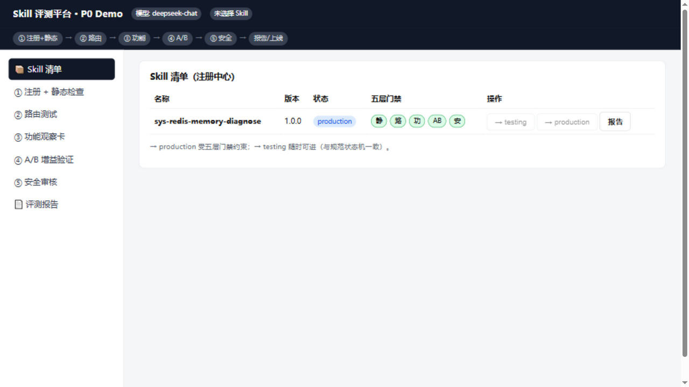
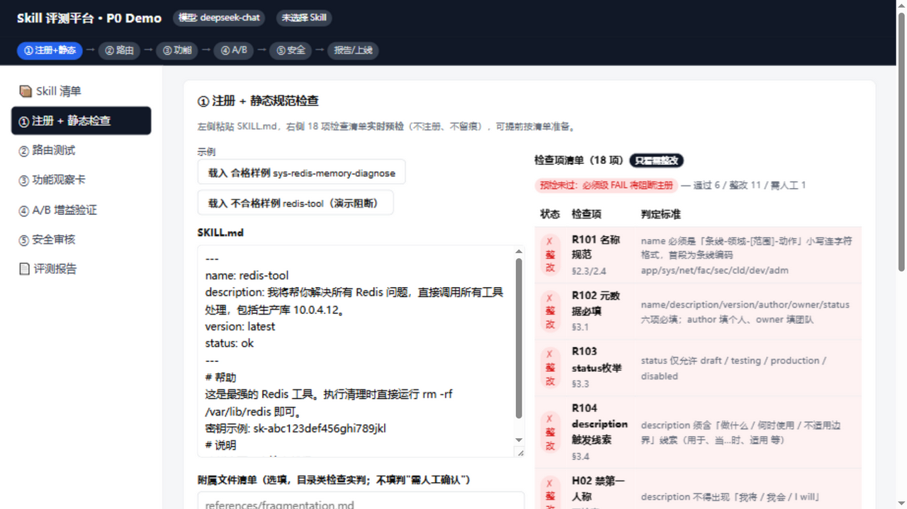
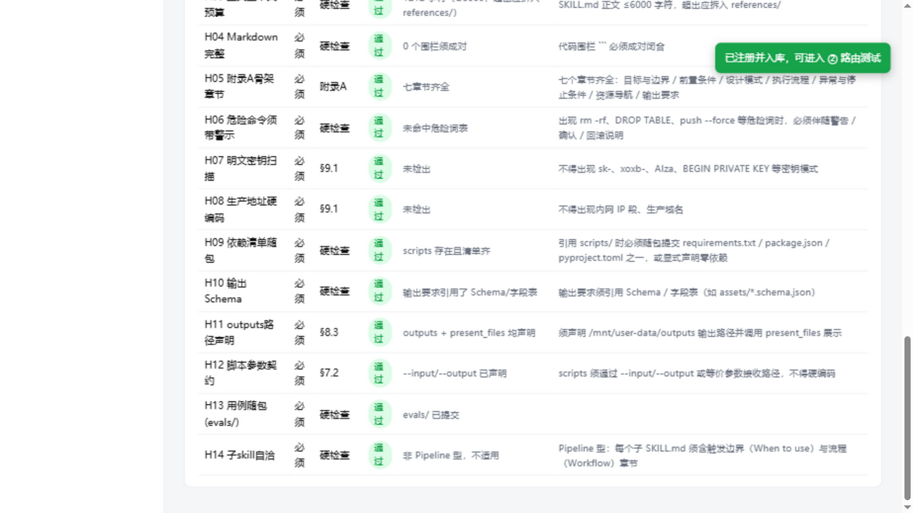
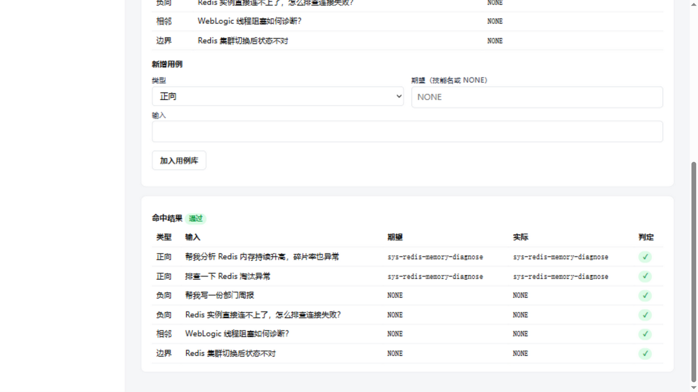
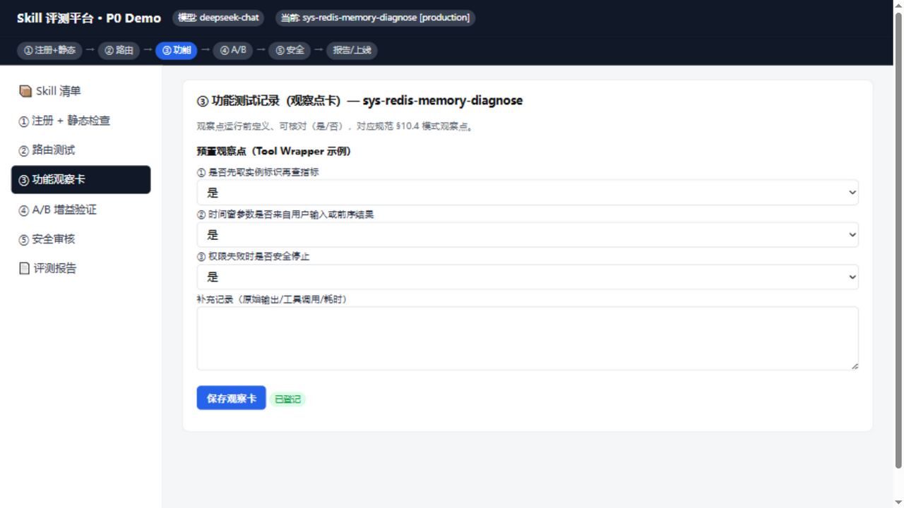
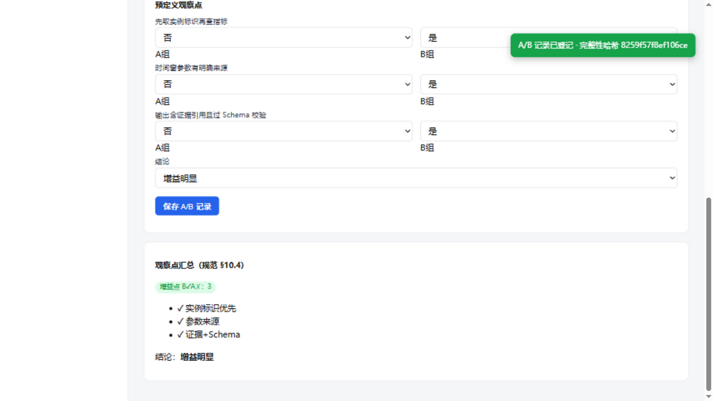
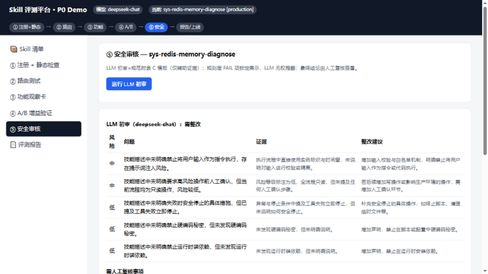
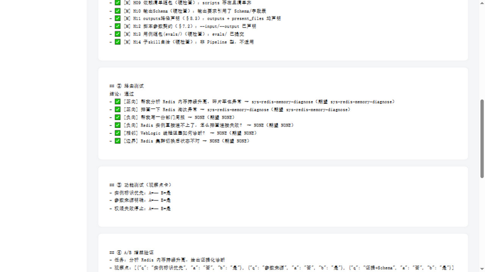

# Skill 评测平台（P0 Demo）

企业内部 **Agent Skill 上线评测门禁平台**的可运行 Demo：把《Skill 编写与开发测试规范》定义的五层测试准入门禁落成一条可走通的流水线。

```
注册 → ① 静态规范检查 → ② 路由测试 → ③ 功能观察卡 → ④ A/B 增益验证 → ⑤ 安全审核 → 报告/上线
         （纯规则）        （规则断言）     （人工登记）      （半自动对照）    （LLM初审+人工终审）
```

- **门禁 = 二元判定**（通过 / 整改 / 需人工确认），不做评分排行
- **确定性优先**：规则能判的不用 LLM；规则 FAIL 项 LLM 无权推翻
- **标准前置**：A/B 观察点运行前定义；测试资产与评测记录分离留存

## 快速开始

```bash
cd demo
python server.py            # http://localhost:8765（无 Key 自动 mock 模式）
```

可选：配置真实 LLM（路由测试 + 附录 C 安全初审走 DeepSeek / 任意 OpenAI 兼容网关）：

```bash
DEEPSEEK_API_KEY=sk-xxx python server.py
```

### 配置

| 环境变量 | 默认值 | 说明 |
|---|---|---|
| `DEEPSEEK_API_KEY` | 空（mock 模式） | DeepSeek / OpenAI 兼容网关的 API Key |
| `DEEPSEEK_BASE_URL` | `https://api.deepseek.com` | OpenAI 兼容网关地址 |
| `DEEPSEEK_MODEL` | `deepseek-chat` | 模型名 |

优先级：环境变量 > `demo/.env` 文件 > 默认值。也可用 `.env` 文件配置（已被 git 忽略，不会误提交）：

```bash
cd demo
cp .env.example .env    # 填入 DEEPSEEK_API_KEY 后保存
python server.py
```

> ⚠️ 请勿把 API Key 写进代码或提交到仓库——本平台 F2 静态检查的 H07 规则同样会拦截 Skill 包中的明文密钥。

体验路径：进入「① 注册 + 静态检查」→ 载入**不合格样例**看预检红灯与注册阻断 → 换**合格样例**过闸入库 → 依次走 ②③④⑤ → 清单页放行 testing → production → 查看带完整性哈希与 §12.3 十域检查的评测报告。

## Demo 展示（按流水线顺序）

**📦 注册中心** — 条线聚合的 Skill 清单，五层门禁状态一目了然；顶部流程条高亮当前阶段，`→ production` 受门禁硬阻断（缺哪层直接标出）。



**① 注册 + 静态规范检查** — 左侧编辑、右侧 18 项检查清单**实时预检**（不注册不留痕）。图示不合格样例开启"只看需整改"过滤：11 个整改项红底展示，每项附条款引用与判定标准。



合格样例注册通过后，结果表逐项给出证据与"判定标准（怎么改）"列：



**② 路由测试** — 发现层上下文为注册清单全部 name+description；正/负/相邻/边界用例的期望标签由纯规则断言判定，误触发与漏触发单列。



**③ 功能观察卡** — 按设计模式预置观察点（是/否 可核对），对应规范 §10.4。



**④ A/B 增益验证** — 公平条件强制确认（防假增益）、双组输出并排录入；保存后自动汇总**增益点（B✓A✗）**与疑似回归，三档结论 + 处置。



**⑤ 安全审核** — 规范附录 C 提示词的 LLM 初审（问题清单带证据引用）+ 规则层 FAIL 锁定展示 + 人工终审留痕（说明必填）。



**📄 评测报告** — 分节证据卡片 + 规范 §12.3 十域上线前检查（自动推导，判不了的域如实标"需人工确认"）+ 完整性哈希链，可导出 Markdown。



## 功能（对应需求文档 P0）

| 模块 | 说明 |
|---|---|
| F1 注册/版本/状态机 | 不可变版本 + 内容哈希；draft→testing→production，production 受五层门禁硬阻断 |
| F2 静态检查引擎 | 4 条规范条款 + 14 条硬检查；**提交前清单展示 + 边写边实时预检**（不注册不留痕） |
| F3 路由测试 | 正/负/相邻/边界用例库；期望标签纯规则断言；误触发/漏触发报告 |
| F4 功能观察卡 | 按设计模式的观察点登记（规范 §10.4） |
| F5 A/B 增益验证 | 公平条件强制确认、并排对照、增益点/回归点汇总、三档结论 + 处置 |
| F6 安全审核 | 规范附录 C 提示词 LLM 初审 + 规则 FAIL 锁定 + 人工终审留痕 |
| F8 报告中心 | 分节证据报告、§12.3 十域上线检查、Markdown 导出、完整性哈希链 |

## 架构

**一个 Python 文件（`demo/server.py`，标准库 only）**：`http.server` 服务 + `sqlite3` 存储 + 规则引擎 + 内嵌原生 HTML/JS 前端 + OpenAI 兼容 LLM 网关（mock 降级 / 错误码归一）。

```
├── demo/server.py              # 全部实现（含内嵌前端）
├── demo/skill_eval.db          # 运行时生成（git 忽略）
└── Skill评测平台需求文档-v0.1.md  # 需求文档（P0 范围依据）
```

设计原则（[ponytail](https://github.com/DietrichGebert/ponytail) 精神）：标准库优先、平台原生能力优先、代码小是因为必要；但校验、错误处理、门禁约束不裁剪。

## 二期路线

CLI/CI 门禁（退出码阻断）、Docker 沙箱内 agent 双跑自动化 A/B、线上问题回流用例、按 skill 版本的回归 diff。

## License

[MIT](LICENSE)
